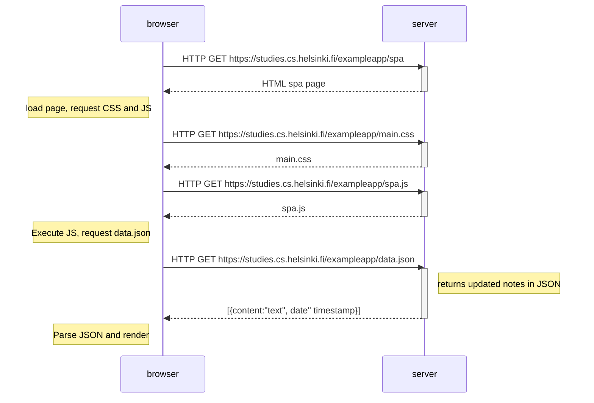

```mermaid
sequenceDiagram
    participant browser
    participant server

    browser->>server: HTTP GET https://studies.cs.helsinki.fi/exampleapp/spa
    activate server
    server-->>browser: HTML spa page
    deactivate server
    Note left of browser: load page, request CSS and JS
    browser->>server: HTTP GET https://studies.cs.helsinki.fi/exampleapp/main.css
    activate server
    server-->>browser: main.css
    deactivate server
    browser->>server: HTTP GET https://studies.cs.helsinki.fi/exampleapp/spa.js
    activate server
    server-->>browser: spa.js
    deactivate server
    Note left of browser: Execute JS, request data.json
    browser->>server: HTTP GET https://studies.cs.helsinki.fi/exampleapp/data.json
    activate server
    Note right of server: returns updated notes in JSON
    server-->>browser: [{content:"text", date" timestamp}]
    deactivate server
    Note left of browser: Parse JSON and render

```