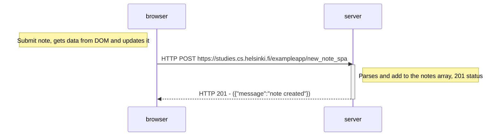

```mermaid
sequenceDiagram
    participant browser
    participant server

    Note left of browser: Submit note, gets data from DOM and updates it
    browser->>server: HTTP POST https://studies.cs.helsinki.fi/exampleapp/new_note_spa
    activate server
    Note right of server: Parses and add to the notes array, 201 status
    server-->>browser: HTTP 201 - ({"message":"note created"})
    deactivate server
   
   

```